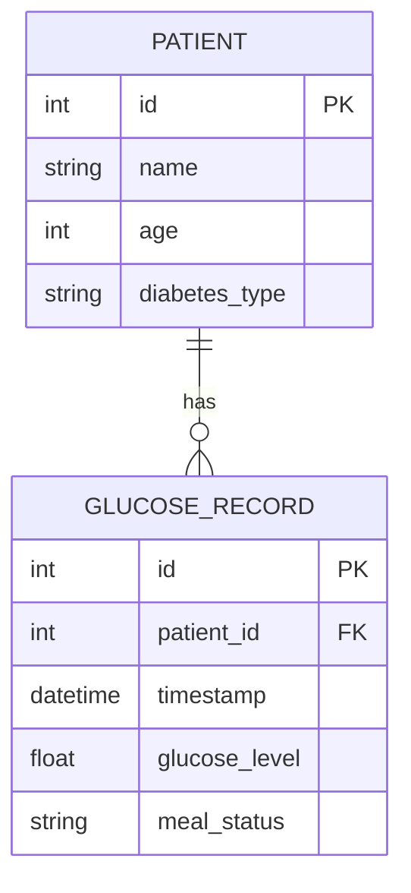

# AI Healthcare Monitoring System

A microservices-based real-time healthcare monitoring application that tracks patient glucose levels, simulates live medical data, and utilizes an AI-driven engine to provide instant medical analysis and voice-assisted conversational feedback.

## Architecture

The system is designed with a modern microservices architecture, fully containerized using Docker.

- **Frontend**: React (TypeScript), Vite, TailwindCSS, Recharts, Web Speech API (STT & TTS)
- **Backend**: FastAPI, SQLAlchemy (PostgreSQL), WebSockets
- **AI Engine**: CrewAI, Groq (llama-3.1-8b-instant), LiteLLM
- **Database**: PostgreSQL 15
- **Simulator**: Python-based real-time data generator

## Key Features

1. **Real-Time Dashboard**: Visualizes live glucose data streams using Recharts. Chart updates via WebSockets without page refreshes.
2. **Data Simulator**: Continuously pushes realistic glucose measurements to the backend, simulating a continuous glucose monitor (CGM).
3. **AI Medical Analyst**: Utilizes CrewAI and Groq's Llama 3 models to analyze historical glucose data and generate structured medical assessments and recommendations.
4. **Voice Assistant**: Integrated directly into the dashboard. Users can ask questions via microphone, and the AI will analyze the data, provide a concise response, and read it aloud using browser-native Text-to-Speech (TTS).
5. **Emergency Alerts**: Real-time visual and audio alerts triggered if glucose levels drop below 70 mg/dL or spike above 180 mg/dL.

---

## Database Schema

The database utilizes PostgreSQL and is structured as follows:



### 1. `patients` Table
| Column | Type | Constraints | Description |
| :--- | :--- | :--- | :--- |
| `id` | Integer | Primary Key | Unique identifier for the patient. |
| `name` | String | Not Null | Patient's full name. |
| `age` | Integer | Not Null | Patient's age. |
| `diabetes_type` | String | Not Null | Type of diabetes (e.g., Type 1, Type 2). |

### 2. `glucose_records` Table
| Column | Type | Constraints | Description |
| :--- | :--- | :--- | :--- |
| `id` | Integer | Primary Key | Unique identifier for the record. |
| `patient_id` | Integer | Foreign Key | References `patients.id`. |
| `timestamp` | DateTime | Default `now()` | Exact time the reading was taken. |
| `glucose_level` | Float | Not Null | Glucose level in mg/dL. |
| `meal_status` | String | Not Null | E.g., Fasting, Post-meal, Random. |

---

## Prerequisites

- Docker and Docker Compose installed on your system.
- A valid Groq API Key.

## Setup and Installation

Follow these steps to deploy the application locally:

### 1. Clone the repository
```bash
git clone https://github.com/HosseinZareinejad/AI-Healthcare-Monitoring-System.git
cd AI-Healthcare-Monitoring-System
```

### 2. Configure Environment Variables
Create or modify the `.env` file in the root directory and add your API key:
```bash
echo "GROQ_API_KEY=your_api_key_here" > .env
```

### 3. Build and Start the Containers
Use Docker Compose to build the images and run the application in the background:
```bash
docker-compose up --build -d
```

### 4. Verify Services are Running
Check the status of your containers to ensure they are up:
```bash
docker-compose ps
```

The following services will be available:
- **Frontend Dashboard**: [http://localhost:5173](http://localhost:5173)
- **Backend API Docs (Swagger UI)**: [http://localhost:8000/docs](http://localhost:8000/docs)
- **PostgreSQL Database**: Port `5432`

---

## Usage Guide

- **Live Monitoring**: Once the containers are running, the Data Simulator will automatically register a default patient and begin streaming glucose data every 10 seconds. Open the Frontend Dashboard to watch the real-time updates.
- **Generate AI Report**: Click the "Generate Report" button to receive a comprehensive analysis of the recent glucose trends directly from the CrewAI agent.
- **Voice Interactions**: Click the Microphone icon in the AI Analyst section. Speak your question aloud. The assistant will transcribe your voice, process the query through the LLM, display the text response, and read it out loud.

## Project Structure

```bash
.
├── ai/             # CrewAI configuration, defining agents and tasks
├── backend/        # FastAPI application, SQLAlchemy models, CRUD operations
├── frontend/       # React/Vite application with dashboard components
├── scripts/        # Python scripts including the real-time data simulator
├── docker-compose.yml
└── README.md
```

## License

This project is licensed under the MIT License.
